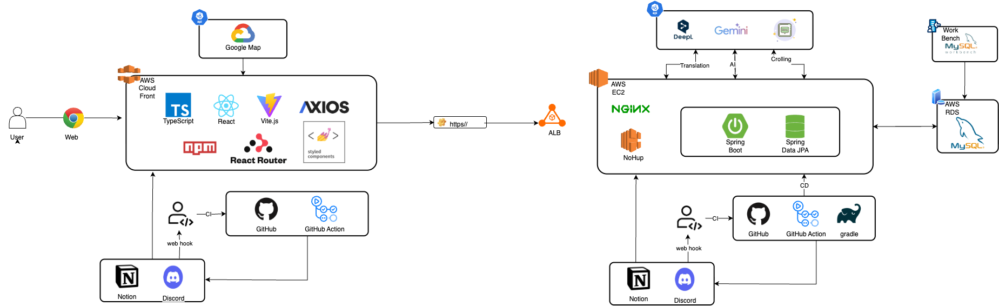

  <h1>mark!t</h1>

> 배포 링크   > **https://mark1t.netlify.app**

 

## 📄 목차

- [📄 목차](#-목차)
- [✍🏻 프로젝트 개요](#-프로젝트-개요)
- [🚀 핵심 기능](#-핵심-기능)
  <!-- - [자주 마주칠 수 있는 Git 문제를 해결해 보세요](#자주-마주칠-수-있는-git-문제를-해결해-보세요)
  - [터미널 환경에서 Git을 조작할 수 있어요](#터미널-환경에서-git을-조작할-수-있어요)
  - [Git 그래프로 변화되는 Git 상황을 확인할 수 있어요](#git-그래프로-변화되는-git-상황을-확인할-수-있어요)
  - [문제 해결이 어렵다면 도움받을 수 있어요](#문제-해결이-어렵다면-도움받을-수-있어요)
  - [정답을 맞추면 내 답안을 공유할 수 있어요](#정답을-맞추면-내-답안을-공유할-수-있어요) -->
- [⚙️ 기술 스택](#️-기술-스택)
- [🏛️ 시스템 아키텍처](#️-시스템-아키텍처)
- [🔎 FE 기술적 도전](#-fe-기술적-도전)
  - [디자인 시스템 구축](#디자인-시스템-구축)
  - [컴포넌트 테스트 코드](#컴포넌트-테스트-코드)
  - [D3를 이용한 데이터 시각화](#d3를-이용한-데이터-시각화)
  - [UX 개선](#ux-개선)
- [🧡 팀원 소개](#-팀원-소개)

 

## ✍🏻 프로젝트 개요

Mark!t은 외국인 관광객들의 물음표를 느낌표로 바꿔줄 전통시장 이용도우미 입니다. 이 서비스를 통해 전통시장에 방문한 외국인들이 소통의 문제 없이 전통시장을 구경하는 경험을 할 수 있습니다.

 

## 🚀 핵심 기능

### 시장의 정보를 지도에서 확인하고 **주요 장소**를 저장해요

> 찾고 싶은 시장을 지도에서 검색해보세요!

- ATM기 및 주요 맛집, 상점 등의 정보와 위치를 확인해요
- 지도 내 하단 버튼 클릭 시 내 위치, 시장 위치 중앙으로 이동할 수 있어요
- 마음에 드는 장소를 북마크하여 MARKED 메뉴에 저장할 수 있어요
- 다국의 관광객을 위해 서비스 전체에서 영/중/한 전역 언어 변경을 지원해요

</aside>

### 현지인이 작성한 아티클을 읽고 장소를 추천받아요

> 광장시장의 다양한 장소들을 아티클을 통해 미리 확인해요
> 마음에 드는 아티클을 저장할 수 있어요

- 현지인이 직접 작성한 아티클을 통해 전통시장을 더욱 현지에 가깝게 즐길 수 있어요
- 광장시장의 맛집, 주변 코스, 쇼핑 코스, 역사적 장소 등을 아티클을 통해 미리 확인해요
- 마음에 드는 아티클을 북마크하여 MARKED 메뉴에 저장할 수 있어요
- 각 아티클에서의 관련 장소를 추천받고 지도에서 실제 위치를 확인해요

|                                                  이미지1                                                  |                                                  이미지2                                                  |
| :-------------------------------------------------------------------------------------------------------: | :-------------------------------------------------------------------------------------------------------: |
|  |  |

### 전통시장에 방문했을 때 정보 파악이 어렵다면? 전통시장 맞춤형 AI 이미지 검색 및 채팅 기능을 통해 빠르게 확인해요

> AI에 ‘광장시장 전문 큐레이터’라는 역할을 부여하고 실데이터를 통해 학습시켜 답변의 신뢰성을 높이고, 광장시장 판매 품목을 우선적으로 인식하여 답변을 제공합니다.

|                                                  이미지1                                                  |                                                  이미지2                                                  | 이미지3                                                                                                   |
| :-------------------------------------------------------------------------------------------------------: | :-------------------------------------------------------------------------------------------------------: | --------------------------------------------------------------------------------------------------------- |
|  |  |  |

### 자주 쓰이는 기본 문장 표출 및 AI를 통한 실시간 번역 기능을 통해 더욱 간편하고 효율적인 의사소통을 도와요

- 전통시장에서 자주 사용되는 기본적인 표현들을 확인하고 필요한 상황에 바로바로 꺼내써요
- 표현 클릭 시, 해당 표현에 대한 한국어 텍스트 및 음성을 상인에게 바로 제시할 수 있어요
- 더 자유로운 의사소통이 필요하다면 실시간 텍스트 번역 및 음성 번역 기능을 사용할 수 있어요

|                                                  이미지1                                                  |                                                  이미지2                                                  |
| :-------------------------------------------------------------------------------------------------------: | :-------------------------------------------------------------------------------------------------------: |
|  |  |

- 텍스트 번역을 통해 상인에게 하고싶은 말을 전달할 수 있어요
- 텍스트 번역 시, 번역 결과에 따라 AI가 전통시장에서 사용하면 좋을 관련 표현을 함께 추천해줘요
- 상인과의 실시간 대화가 필요한 상황에서는 쌍방향 음성 번역 기능을 통해 간편하게 대화를 주고받을 수 있어요

|                                                      이미지1                                                      |                                                      이미지2                                                      |
| :---------------------------------------------------------------------------------------------------------------: | :---------------------------------------------------------------------------------------------------------------: |
|  |  |

 

## ⚙️ 기술 스택

<table>
    <thead>
        <tr>
            <th>분류</th>
            <th>기술 스택</th>
        </tr>
    </thead>
    <tbody>
        <tr>
            <td>
                
공통

            </td>
            <td>
                
                
            </td>
        </tr>
        <tr>
            <td>
                  
프론트엔드

            </td>
            <td>
                  
              
            </td>
        </tr>
        <tr>
            <td>
                
백엔드

            </td>
            <td>
                
                
              
            </td>
        </tr>
                <tr>
            <td>
                
패키지 매니저

            </td>
            <td>

              
            </td>
        </tr>
        <tr>
            <td>
                
배포

            </td>
            <td>

              
            </td>
        </tr>
        <tr>
            <td>
                
협업

            </td>
            <td>

                
            </td>
        </tr>
    </tbody>
</table>

 

## 🏛️ 시스템 아키텍처

## 🧡 팀원 소개

|                                                  이동건                                                   |                                                  임현우                                                   |                                                 박성재                                                  |                                                 강근우                                                  |                                                 김강민                                                  |                                                 박세라                                                  |
| :-------------------------------------------------------------------------------------------------------: | :-------------------------------------------------------------------------------------------------------: | :-----------------------------------------------------------------------------------------------------: | :-----------------------------------------------------------------------------------------------------: | :-----------------------------------------------------------------------------------------------------: | :-----------------------------------------------------------------------------------------------------: |
|  |  |  |  |  |  |
|                                                  **BE**                                                   |                                                  **BE**                                                   |                                                 **FE**                                                  |                                                 **FE**                                                  |                                                 **PD**                                                  |                                                 **PD**                                                  |
|                                [@nicerjs23](https://github.com/nicerjs23)                                 |                                   [@pyeree](https://github.com/pyeree)                                    |                                  [@sem201](https://github.com/sem201)                                   |                                [@gn00py48](https://github.com/gn00py48)                                 |                                 [@smilekm](https://github.com/smilekm)                                  |                                 [@smilekm](https://github.com/smilekm)                                  |
